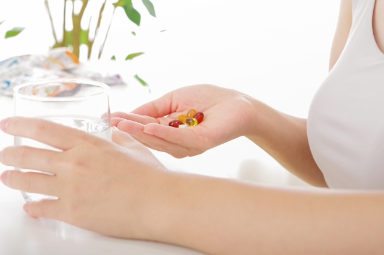

## 連休中に体調を崩さないために！ゴールデンウィークの健康管理術

楽しみにしていたゴールデンウィーク。旅行や帰省、レジャーなどで予定が盛りだくさんという方も多いのではないでしょうか？  
ですがこの時期、生活リズムの乱れや食べ過ぎ・疲れの蓄積により、体調を崩してしまう人も少なくありません。

せっかくの連休を元気に過ごすために、今回はゴールデンウィーク中の健康管理術をご紹介します。

---

### 1. 生活リズムを極端に崩さない

「せっかくの休みだから」と夜更かし・朝寝坊が続くと、自律神経のバランスが乱れやすくなります。

**✅ ポイント：**
- 起床・就寝の時間は普段と±1〜2時間以内にする
- 朝はカーテンを開けて日光を浴び、体内時計をリセット
- 夜はスマホやテレビを早めにオフにして、リラックスタイムを意識

---

### 2. 食べ過ぎ・飲みすぎに注意

外食やバーベキューなど、楽しい食事の機会が増える一方で、つい食べ過ぎてしまうのが連休の落とし穴です。

**✅ ポイント：**
- 一口目は野菜や汁物から → 血糖値の急上昇を防ぐ
- アルコールは「水1杯と交互に飲む」を習慣に
- 腸をいたわる発酵食品（味噌、ヨーグルト、ぬか漬けなど）も意識して摂取

---

### 3. 移動中の「座りっぱなし」を避ける

長時間の移動は、足のむくみや血流の滞り、腰痛の原因になります。

**✅ ポイント：**
- 1時間に1回は軽く立ってストレッチ
- 車中では足首をクルクル回す、かかとの上げ下げ運動を
- 水分補給を忘れずに（カフェインではなく、常温の水や麦茶などがおすすめ）

---

### 4. 日中の紫外線・気温差対策

春とはいえ、5月の紫外線は意外と強め。日中と朝晩の気温差もあるので、体調管理に影響します。

**✅ ポイント：**
- UVカットの帽子やサングラス、日焼け止めはお出かけの必須アイテム
- 薄手の羽織りものやストールで気温調整を
- 水分・塩分補給も忘れずに（特に屋外レジャーでは重要！）

---

### 5. 連休後半は“休息日”を設ける

最終日まで予定を詰め込みすぎると、連休明けにどっと疲れが出てしまいます。

**✅ ポイント：**
- 連休の最後1〜2日は“体と心を整える日”に
- 散歩・ストレッチ・湯船での入浴など、リラックス時間を
- 連休明けの仕事や学校の準備をしておくと、気持ちが楽になります

---

## おわりに

連休は心も体もリフレッシュできる貴重な時間。  
ですが「無理をしない」「少しだけ意識して整える」ことで、体調を崩さずに楽しい思い出を作ることができます。

今年のゴールデンウィークは、**“楽しみながら健康管理もできる自分”** を目指してみませんか？

### 📸 フォトギャラリー

