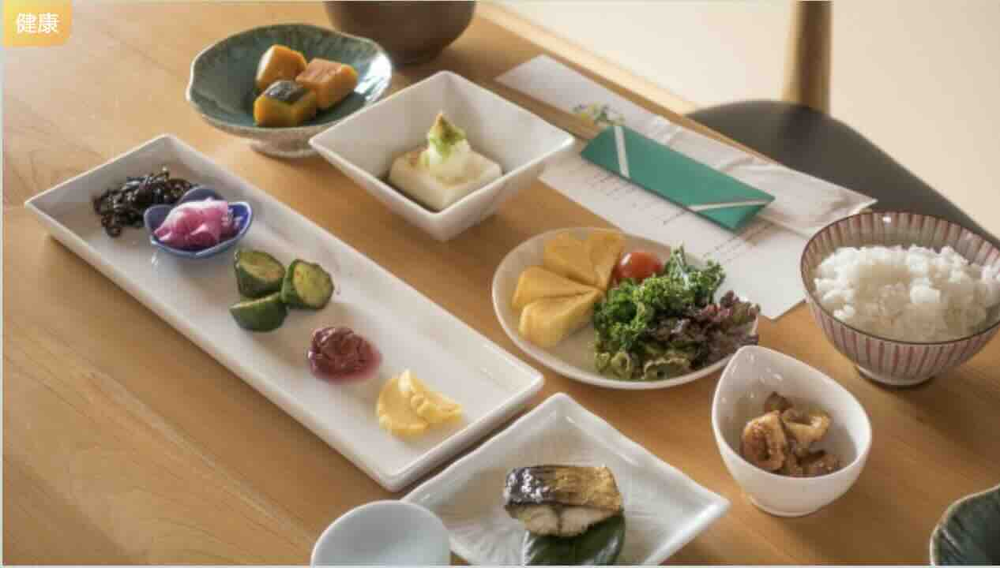

寒い季節が訪れ、私たちは温かい食事や栄養価の高い食材を求める季節に差し掛かりました。冷えた季節に体温を保ち、美容と健康をサポートするために、冬の食事プランを見直しましょう。この記事では、寒い季節にぴったりの温かい料理や栄養満点の食事のアイデアを提供します。

冬の食事の特徴

冷えた季節には、体温を維持し、免疫力を高めるために特定の食材や調理法が必要です。冬の食事の特徴を以下に示します。

温かい料理: スープ、シチュー、鍋、温かいオーブン料理など、温かい料理が欠かせません。
栄養価の高い食材: 野菜、フルーツ、穀物、たんぱく質をバランスよく摂り、栄養バランスを保ちましょう。
スパイスとハーブ: ショウガ、シナモン、クローブ、ガーリックなどのスパイスとハーブは、体を温めるのに役立ちます。
シーズン食材: 季節に合った食材を活用し、新鮮な食事を楽しむことが大切です。
暖かい飲み物: ハーブティーや温かいレモンウォーターなど、暖かい飲み物で体を温めましょう。
冬の食事プラン

以下に、冷えた季節にぴったりの食事プランを提案します。

朝食
オートミール: オートミールは栄養価が高く、朝のエネルギーを提供します。シナモンやハチミツをトッピングして温かく召し上がれ。

卵料理: スクランブルエッグやオムレツに野菜を加え、たんぱく質とビタミンを摂りましょう。

ホットヨーグルト: ホットヨーグルトに蜂蜜やナッツをかけて、胃を温め、腸内健康をサポートしましょう。

昼食
スープ: 野菜や鶏肉を使用した温かいスープは、ランチにぴったりです。トマトスープ、クリームシチュー、みそ汁などがおすすめ。

サラダ: サラダには栄養価の高い野菜をたっぷりと加えて、バランスの良い食事にしましょう。

ホットサンドイッチ: グリルチーズサンドイッチ、ホットパストラミサンドイッチなど、温かいサンドイッチも美味しい選択です。

夕食
鍋料理: しゃぶしゃぶ、すき焼き、チーズフォンデュなど、家族や友人と楽しむ鍋料理が温かい冬の夕食です。

ロースト: 鶏肉、野菜、さつまいもをオーブンでローストして、美味しい温かい夕食を楽しんでください。

カレー: スパイスを使ったカレーは、体を温めるのに最適です。野菜やたんぱく質を加えて栄養豊富にしましょう。

間食
ホットチョコレート: 寒い日には、ホットチョコレートでほっこり温まりましょう。

ナッツとドライフルーツ: ナッツとドライフルーツはエネルギーを補給し、お腹が減ったときの間食に最適です。

応用編: 冷え性対策のスーパーフード
生姜: 生姜は体を温め、消化を助ける働きがあります。生姜ティーや生姜風味の料理を試してみましょう。

にんにく: にんにくには免疫力を向上させる効果があり、体温を上げるのに役立ちます。

カボチャ: カボチャはビタミンAとCを豊富に含み、免疫力を高め、肌を健康に保つのに役立ちます。

冷えた季節にぴったりの食事プランを実践することで、体温を保ち、美容と健康をサポートできます。季節の食材を活用し、美味しい料理を楽しみながら、寒冷な冬を乗り越えましょう。

### 📸 フォトギャラリー

